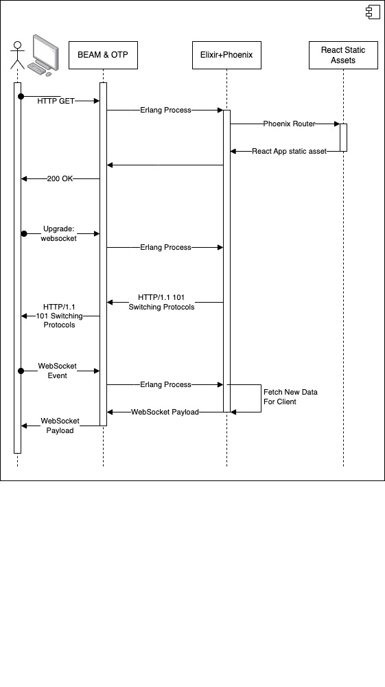

# Elixir/Phoenix - Options for Delivering Your FrontEnd

> elixir_phoenix_react_static_assets

-----
#### Notables:
* All React code in one directory.
* All website routing is client side.
* No Server to Client async updating.
-----

This is an Elixir and Phoenix application that servers basically no Phoenix routes other than the one that delivers the React app assets to the client's browser.

This trivial example is not useful in most cases. It can be used for a SPA but with no backend server communication BEYOND reloading the entire app into the client's browser the content is purely static.

The latter examples iterate on this example and introduce bi-directional communication which will greatly enhance its useability and use-cases.

> elixir_phoenix_react_w_websockets

-----
#### Notables:
* React code now lives in standard Elixir/Phoenix project structure.
* All website routing is *still* client side.
* Server to Client async updating via WebSocket.
-----

This is an Elixir and Phoenix application that servers basically no Phoenix routes other than the one that delivers the React app assets to the client's browser.

Unlike the first example this one does have frontend <--> backend communication setup via WebSocket.
