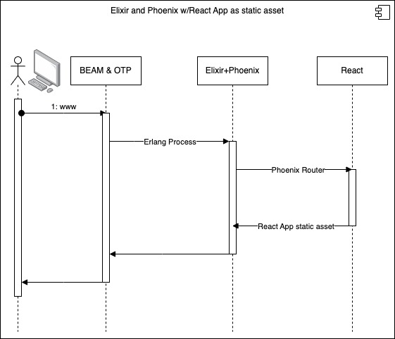

# Elixir/Phoenix - Options for Delivering Your FrontEnd

> elixir_phoenix_react_static_assets

This is an Elixir and Phoenix application that servers basically no Phoenix routes other than the one that delivers the React app assets to the client's browser.

This trivial example is not useful in most cases. It can be used for a SPA but with no backend server communication BEYOND reloading the entire app into the client's browser the content is purely static.

The latter examples iterate on this example and introduce bi-directional communication which will greatly enhance its useability and use-cases.

> 
